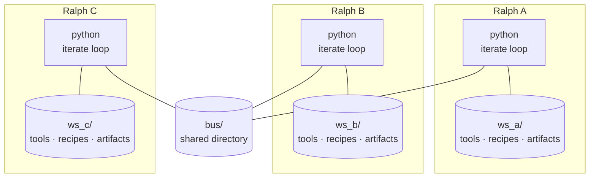

# Ralph: tools all the way down

What made humans dominant wasn't raw intelligence — it was the *combination*
of two abilities: we **build tools**, and we **share them**. A single hominid
who knaps a flint blade is a curiosity. A tribe that knaps blades, passes the
technique forward, and trades them with neighbors is an evolutionary force.

Ralph is a coding agent, in a few hundred lines of Python, built around that
observation: tool *creation* and tool *sharing* as first-class primitives.
This post is the design rationale — what problem it attacks, the bet it
makes, how the machinery works, and what the early evidence says.

---

## The problem: agents that forget, tools that die

Most agent harnesses keep a growing message history. Each turn appends to it;
the agent reasons over the whole transcript. This works, but it has problems:
the transcript grows monotonically and blows past context windows; a bad turn
poisons every subsequent turn; restarting means replaying the whole transcript.

There's a second, quieter problem. When today's agents *do* write helper code
mid-task — a parser, a solver, a validation routine — that code is a private
artifact of one rollout. It is used once and lost when the conversation ends.
The next agent attacking the same class of problem re-derives it from scratch.
Every flint blade is knapped, used, and dropped in the river.

AI systems have been climbing the tool ladder one rung at a time: code
generation (mostly mastered), function calling against pre-defined tools
(mostly mastered), tool creation on demand (emerging — ToolMaker, Voyager's
skill library). But creation and *sharing* haven't been put together as
primitives of the same loop. That's the gap Ralph aims at.

## The insight: make the filesystem the substrate

Ralph takes the opposite stance from transcript-keeping harnesses: **every
iteration is a brand-new conversation with a fresh model context**. The
agent's "memory" is whatever it left on disk in `workspace/`. To continue
work, the agent uses `ls` and `read` to rediscover state from scratch. It
doesn't remember what it tried before, but it sees what's in the workspace
right now — which is the only thing that actually matters for "can I make
progress next?"

Once the filesystem is the substrate, tool creation and tool sharing stop
being exotic:

- A **tool** is a `.py` file in `workspace/tools/` with a `TOOL = {...}` dict
  and a `run()` function. The loop reloads the directory after every write, so
  a tool the agent authors mid-response is callable on its very next tool use.
- **Sharing** is copying a file. Peers request tools by *description* over a
  shared bus; the responder ranks its own artifacts by relevance and sends the
  top matches as verbatim source — no LLM round-trip on the responder side, no
  retyping (and therefore no corruption) of the source bytes.

The shift is from "the LLM calls tools" to "the LLM lives in a workshop,
builds tools, files them on a shelf, and borrows from the shelf next door."

---

## The algorithm

```
Input:  prompt file P, workspace W, peer bus B
Output: artifacts in W, recipes in W/memory/recipes

while not Done(W) and i < MAX_ITERATIONS do
    i        ← i + 1
    context  ← PeersPreamble(B)  ∥  SelectRelevantRecipes(W)  ∥  ReadFile(P)
    msgs     ← [ System(SYSTEM_PROMPT), User(context) ]
    tools    ← Builtins  ∪  LoadDynamicTools(W/tools)

    while True do
        msgs ← msgs ∥ LLM(msgs, tools)
        if no tool_calls(msgs[-1]) then break
        for tc in tool_calls(msgs[-1]) do
            (W, B, result) ← Exec(tc, W, B)
            msgs           ← msgs ∥ Result(result)
            if tc.name ∈ {write, edit, check_response} then
                tools ← Builtins ∪ LoadDynamicTools(W/tools)   // reload

    LearnRecipes(msgs, W)        // distill → W/memory/recipes/*.py
    PublishStatus(B, W)          // surface inventory + expertise to peers
```

Three loops, nested:
1. The outer loop runs until `mark_done` writes `W/DONE`.
2. The inner loop is a standard tool-use loop within one fresh context.
3. The tool-reload step is implicit: any `write` / `edit` / `check_response`
   reloads `W/tools/` so a tool created mid-response is callable on the very
   next `tool_use`.

## Pictured

A few Ralphs sharing a bus. Each Ralph is a Python process paired with its
own workspace directory; the bus is a shared directory of status files and
named pipes that all the Ralphs read and write. No server, no broker — just
a Python loop next to a `ws_*/` folder, repeated.



---

## Design notes

**Python source is the storage format.** State on disk isn't an opaque blob —
it's `.py` files. Dynamic tools are modules with `TOOL = {...}` and a `run()`
function. Recipes are files with `MEMORY = {...}`. Indices are
`INDEX = [...]`. The persisted form is the same Python objects the agent works
with, just frozen to text — readable, diffable, hand-editable, runnable. No
JSON, no pickle, no SQLite.

The format encodes a sharp line: **metadata is a literal, behavior is code.**
The `TOOL` / `MEMORY` / `INDEX` dicts are pure literals, read back via
`ast.literal_eval` without executing the file; only `run()` is ever executed,
and only when the tool is loaded for calling. That split is what lets the bus
rank and ship a peer's tools — including ones whose `run()` would crash —
without running a single line of them.

**Writes are eager.** Every tool the agent saves, every recipe the learn pass
extracts, every LRU touch hits disk the moment it's produced. There's no
"save on shutdown" or "flush at checkpoint" — a crash or `kill -9` loses
nothing already done. The price is more writes; the benefit is that the
entire state of the world is always on disk and always inspectable with `cat`.

**Tools vs. recipes.** Anything algorithmic gets codified as a tool (Python in
`W/tools/`). Anything procedural or heuristic — strategies, when-to-use-which,
hard-won judgment — becomes a recipe in `W/memory/recipes/`. Two artifacts,
two lifetimes: code is executable, recipes are loaded as text into the next
relevant iteration.

**The bus is filesystem + FIFOs, not a server.** Multiple Ralphs share a
directory. Each writes its `<id>.status` file after every iteration; each
reads a named pipe for incoming requests; responses are written as JSON
files (atomically — tmp + rename — so a reader never sees a half-flushed
payload). Auto-fulfillment runs on a daemon thread — when a peer's `ask_ralph`
arrives, the bus reads our own filesystem (top-K matches by keyword overlap
on the requester's description) and writes back a response without ever
consulting the LLM. Tool transfers are byte-verbatim because they never go
through the LLM as a string to retype.

**Peer expertise emerges from the prompt.** At startup, one forced-tool LLM
call summarizes the prompt into a short phrase like "Sudoku solving" or
"Caesar-cipher decryption." This is published in the status file. Other
Ralphs see it in their peer preamble and route asks accordingly. No one has
to declare "I am the expert" — the system extracts it from what the task
asks them to do. If no peer specializes in your problem, you solve it
yourself, and the next ralph attacking a similar task will find *you* on
the bus. Find help, or become the help.

**No bash, no shell, no test runner — on purpose.** This deserves more than a
passing mention, because it looks like a missing feature and is actually the
load-bearing constraint. Ralph writes Python; it cannot execute arbitrary
commands. Three things fall out of that:

1. *The sandbox is trivial.* The only enforcement surface is `safe_path` (no
   escaping `workspace/`) and the dynamic-tool loader. There's no command
   allowlist to maintain, no shell-injection surface, no container required.
   An agent that can run `bash` needs a sandbox built around it; an agent
   that can only read and write files inside one directory *is* its own
   sandbox, modulo the tools it writes (which run in-process — the trust
   boundary is the workspace, not the tool).
2. *Crash consistency.* Every state change is a file write. `kill -9` at any
   instant leaves the workspace in a state the next iteration can pick up by
   reading it.
3. *It forces correct-by-construction.* Without a test runner, the agent
   can't flail through guess-run-patch cycles; it has to reason about why the
   code is right. The honest cost: it also can't *confirm* it's right, which
   shows up in the evidence below as a distinct failure mode — knowing when
   to declare done. We consider that trade visible and worth it at this
   scale; an exec tool behind a real sandbox is the obvious fork for anyone
   who disagrees.

---

## Evidence (early, but pointed)

Bundled benchmarks (`benchmark/`) measure three different things:

- **Raw capability** — a 16-task HumanEval subset, run end-to-end through the
  loop, plus single examples of LongBench narrativeqa and oolong-synth for
  long-context navigation via `grep`/`read`.
- **Tool reuse** (`tool_reuse.py`) — five related text-analysis tasks against
  one shared workspace, with a fresh-workspace control. Reuse is detected
  mechanically: a pre-existing tool whose LRU timestamp advanced during a
  task was actually called.
- **Sharing** (`multi_ralph.py`) — the sudoku expert/novice demo made
  quantitative: novice time-to-solution with the expert on the bus vs alone,
  with the solution machine-verified and the tool transfer confirmed (the
  novice's `tools/` must contain the expert's file).

The HumanEval runner grades on two axes — *code correct* and *mark_done
called* — because they fail independently. A representative early run: on
`HumanEval/34` with `claude-haiku-4-5`, Ralph wrote a correct one-line
solution (`return sorted(set(l))`), verified against the canonical check —
but never called `mark_done`, and the runner cut it off. The code was right;
the contract wasn't completed. That failure mode is informative: the
discipline gap is at the meta-protocol level (when to declare a task done),
not at the toolmaking level. The benchmarks now count it as its own category
rather than burying it in "failed."

---

## Related work

**The original Ralph loop.** Ralph is named after Wreck-It Ralph and shaped
by [Geoffrey Huntley's "Ralph Wiggum" technique][rw] — the observation that a
surprising amount of long-horizon work can be done by *just running the same
prompt over and over* until it's done, no clever planner required. This
project keeps that core (re-feed the prompt; the agent rediscovers state from
disk; let iterations carry the load) and adds the surrounding machinery:
dynamic tools, distilled recipes, peer cooperation over a bus, expertise
routing, fail-fast model validation.

[rw]: https://ghuntley.com/ralph/

**Code as the agent harness.** [Ning et al., 2026][harness] survey the shift
from code-as-output to code-as-*substrate* in agent systems, across three
layers: the harness interface, harness mechanisms (planning, memory, tool
use, feedback), and harness scaling (multi-agent coordination via shared code
artifacts). Their tool-use taxonomy — function-oriented,
environment-interaction, verification-driven, workflow-orchestration — frames
what Ralph does: agents that *author* reusable tools, in the lineage of
Voyager's ever-growing skill library and BOSS's synthesized skill chains,
rather than merely calling fixed APIs. Ralph adds the dimension those systems
lack: peer-to-peer tool transfer, where one agent's codified skill becomes
another agent's callable tool without an LLM round-trip.

[harness]: https://arxiv.org/abs/2605.18747

**Coding agents.** Claude Code, Cursor's agent mode, Aider, OpenHands, and
others all solve the long-horizon coding-task problem with much more
sophisticated UIs and tool-use surfaces. Ralph is intentionally tiny — a few
hundred lines you can read in one sitting. The interesting design choices it
keeps relative to the larger systems: (1) every iteration is a *cold start*
on the LLM side, with the filesystem as the only memory; (2) recipes are
*Python source*, not a vector database; (3) peer cooperation is *file-based*,
so a Ralph crashing or being `kill -9`'d doesn't break anyone else.

**"Deep" / long-horizon agents.** A common pattern in long-horizon agents is
planner → sub-agents → filesystem → growing context. Ralph's loop intentionally
doesn't include an explicit planning phase — the plan, if any, lives in the
prompt file (which the agent re-reads every iteration) and in the accumulated
recipes. Sub-agents are replaced by peer Ralphs on the bus, communicating
asymmetrically (ask + auto-fulfill) rather than via parent → child delegation.

**Recursive Language Models** ([Zhang, Kraska, Khattab, 2025][rlm]). RLMs
treat the LLM input as a variable inside a Python REPL and let the LLM write
code that examines, slices, and recursively self-calls over snippets. The
problem they solve is *input scaling*: prompts up to two orders of magnitude
beyond the context window, in a *single* inference call. Ralph solves the
orthogonal problem of *iteration scaling*: tasks too big for any one
inference, where state must survive across thousands of fresh-context turns.
RLM's substrate is in-memory Python variables scoped to one call; Ralph's
substrate is Python source on disk that lives forever. The two compose
cleanly — Ralph's `config.completion` could in principle be bound to
`rlm.completion` so that within one iteration RLM handles oversized inputs
and across iterations Ralph handles oversized tasks. Both share the
intuition that the LLM should sit above a *programmatic* substrate it
manipulates with code rather than a *string* substrate it reads end to end.

[rlm]: https://arxiv.org/abs/2512.24601

**Agent frameworks.** LangChain / LangGraph, AutoGen, CrewAI, LlamaIndex
Agent, smolagents, and similar libraries provide reusable building blocks
(memory backends, tool wrappers, message routing, planner abstractions).
Ralph is deliberately not a framework — it's a single coherent loop with
opinionated defaults: tools are `.py` files in a specific shape, recipes
are `.py` files in a specific shape, peers are processes pointing at the
same directory, memory selection runs an extra forced-tool LLM call per
iteration. The opinions are what make the codebase fit in your head; if you
need configurability beyond what's there, a framework is the better tool.

---

## What's next

- **Scale the sharing experiments.** The multi-Ralph benchmark is one puzzle,
  one pair. The interesting regime is a *village*: many Ralphs, overlapping
  domains, tools accumulating over days. Does the shelf converge on a few
  good blades, or fill with near-duplicates the keyword ranker can't tell
  apart?
- **Better artifact retrieval.** Keyword overlap with light stemming is the
  current ranking for both peer asks and a peer's own shelf. It's
  transparent and dependency-free, but it will be the first thing to break
  at village scale.
- **Close the mark_done gap.** The most consistent failure isn't bad code,
  it's not declaring done. Candidate fixes: a self-check pass before
  `mark_done` is accepted, or a cheap verifier Ralph on the bus whose only
  expertise is "checking other Ralphs' DONE claims."
- **Compose with RLM.** Bind `config.completion` to an RLM-style recursive
  completion so a single iteration can digest inputs far beyond the context
  window, while the outer loop keeps handling tasks far beyond one inference.
